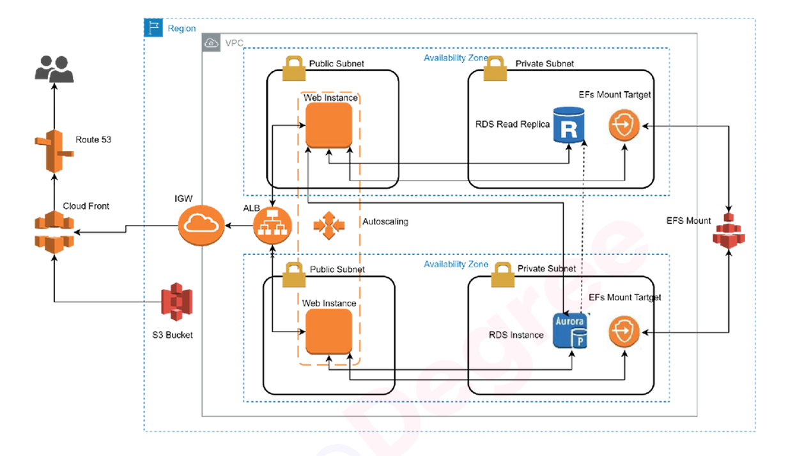
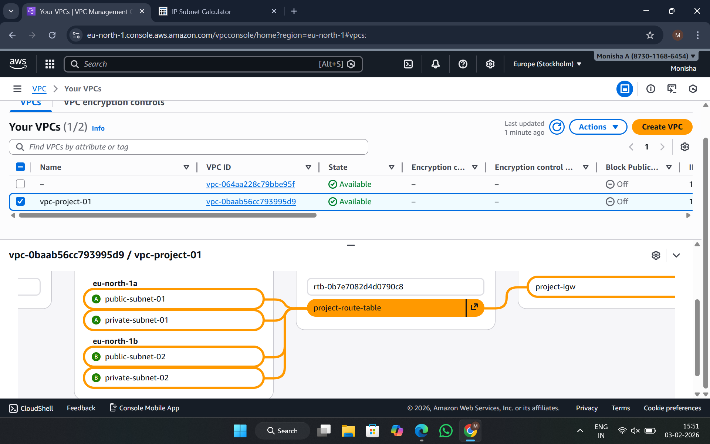
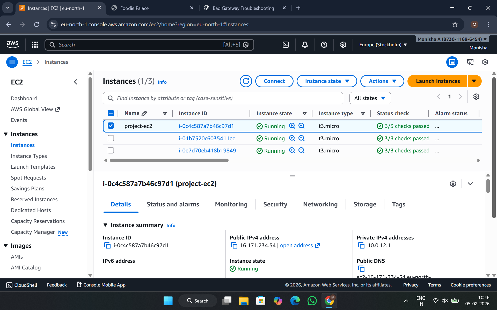
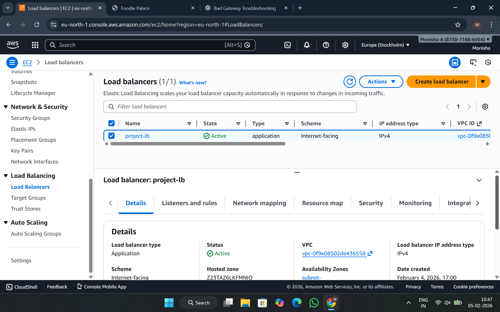
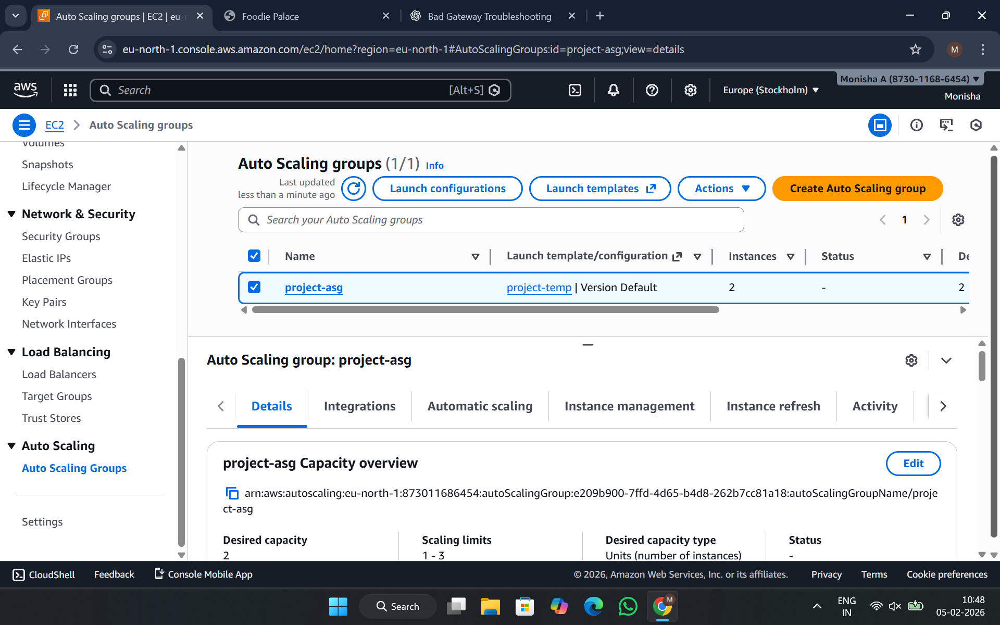
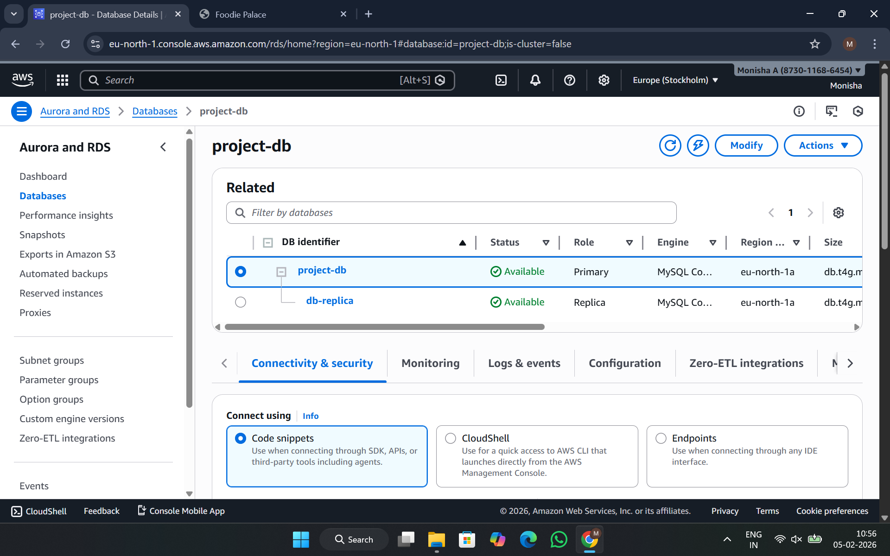

# AWS Cloud Infrastructure Deployment and Automation

## Project Live link -- https://monishaanandraj.github.io/AWS-Cloud-Infrastructure-Deployment-and-Automation/

## Project Overview
This project showcases the design and deployment of a secure, scalable, and highly available AWS cloud infrastructure that simulates a real-world production environment. The solution was implemented using AWS Free Tier resources with a strong emphasis on security best practices, automation, and cost optimization.

All AWS resources were provisioned for demonstration purposes and later terminated to avoid ongoing costs.

---

## Architecture Design
The infrastructure was designed following AWS Well-Architected Framework principles and includes:

- Virtual Private Cloud (VPC) with public and private subnets  
- Internet Gateway for public internet access  
- NAT Gateway to enable outbound internet access for private instances  
- Application Load Balancer (ALB) for distributing incoming traffic  
- Auto Scaling Group (ASG) for elasticity and high availability  
- Amazon RDS with Multi-AZ deployment for database resilience  
- IAM roles and policies based on the principle of least privilege  
- Route 53 for DNS management and failover routing  
- Amazon CloudWatch for monitoring and observability  

---

## AWS Services Used
- Amazon EC2  
- Amazon VPC  
- Application Load Balancer (ALB)  
- Auto Scaling Group (ASG)  
- Amazon RDS (Multi-AZ)  
- Amazon S3  
- Amazon Route 53  
- AWS Identity and Access Management (IAM)  
- Amazon CloudWatch  

---

## Security Implementation
- EC2 instances deployed in private subnets to reduce attack surface  
- Strict inbound and outbound rules enforced using security groups  
- IAM roles attached to EC2 instances to avoid hardcoded credentials  
- Least-privilege IAM policies for controlled access  
- Isolated database tier using subnet groups  

---

## High Availability and Scalability
- Auto Scaling policies configured based on CPU utilization metrics  
- Application Load Balancer health checks for instance monitoring  
- Multi-AZ database deployment to ensure fault tolerance  

---

## Monitoring and Logging
- CloudWatch metrics used to monitor EC2, ALB, and Auto Scaling resources  
- Log storage and analysis configured using Amazon S3  
- Infrastructure health visibility and performance monitoring  

---

## Skills Demonstrated
- AWS Cloud Architecture  
- Networking (VPC, Subnets, Routing, Gateways)  
- Security and IAM Best Practices  
- High Availability and Fault Tolerance  
- Infrastructure Automation Concepts  
- Linux and Bash Scripting  
- Git and Team Collaboration  

---

## Conclusion
This project reflects hands-on experience in designing and deploying enterprise-grade AWS infrastructure with a focus on security, scalability, and operational excellence while maintaining cost efficiency using AWS Free Tier resources.

---
## Screenshots

### Architecture Diagram

### VPC and Subnet Configuration

### EC2 Instances

### Application Load Balancer

### Auto Scaling Group

### RDS Multi-AZ Setup

